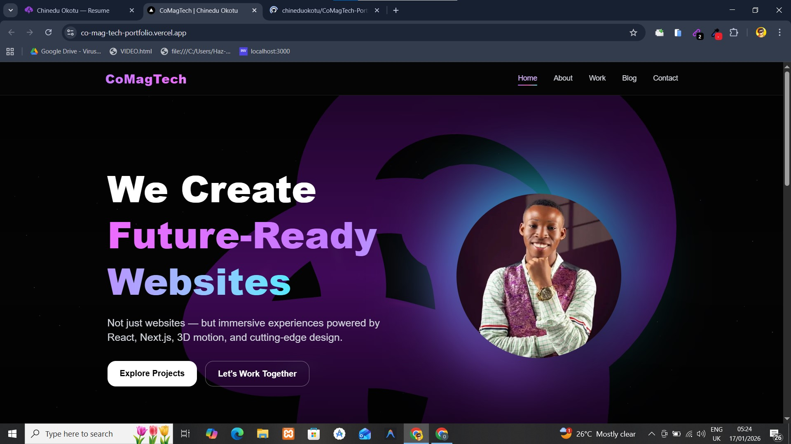

# CoMagTech Portfolio 🚀

A modern, responsive developer portfolio built with **Next.js**, **TypeScript**, and **Tailwind CSS**.  
This project showcases my skills, projects, and services as a frontend/web developer under the **CoMagTech** brand.



## 🔗 Live Demo
👉 https://co-mag-tech-portfolio.vercel.app

---

## ✨ Features

- ⚡ Built with **Next.js** for fast performance and SEO
- 🧠 Written in **TypeScript** for type safety and scalability
- 🎨 Styled using **Tailwind CSS**
- 📱 Fully responsive (mobile, tablet, desktop)
- 🧩 Clean and modern UI/UX design
- 🚀 Deployed on **Vercel**
- 🧭 Smooth navigation between pages (Home, About, Work, Blog, Contact)

---

## 🛠 Tech Stack

- **Framework:** Next.js
- **Language:** TypeScript
- **Styling:** Tailwind CSS
- **Deployment:** Vercel

---

## 📂 Project Structure

```bash
├── app / pages        # Next.js routing
├── components         # Reusable UI components
├── public             # Static assets (images, icons)
├── styles             # Global styles
├── tsconfig.json      # TypeScript configuration
├── tailwind.config.js # Tailwind CSS config
└── README.md
🚀 Getting Started
1️⃣ Clone the repository
bash
Copy code
git clone https://github.com/your-username/CoMagTech-Portfolio.git
2️⃣ Navigate into the project
bash
Copy code
cd CoMagTech-Portfolio
3️⃣ Install dependencies
bash
Copy code
npm install
4️⃣ Run the development server
bash
Copy code
npm run dev
Open 👉 http://localhost:3000 in your browser.

📸 Screenshot
Make sure the image below exists in your project:

bash
Copy code
/public/portfolio.jpg
And reference it in the README like this:

md
Copy code

📬 Contact
If you’d like to work together or have any questions:

Brand: CoMagTech

Name: Chinedu Okotu (Chichi)

Portfolio: https://co-mag-tech-portfolio.vercel.app

📝 License
This project is open-source and available under the MIT License.
